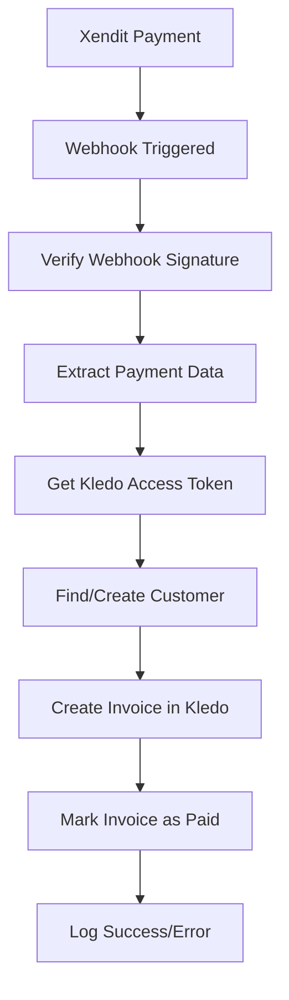

# 🔄 Xendit to Kledo Integration

An automated system that syncs Xendit payment transactions to Kledo invoices using OAuth 2.0 authentication.

## ✨ Features

- 🔐 **OAuth 2.0 Authentication** with Kledo
- 🔄 **Automatic Webhook Processing** from Xendit
- 📊 **Real-time Dashboard** to monitor transactions
- 🎯 **Manual Sync Trigger** for bulk operations
- 💰 **Invoice & Payment Creation** in Kledo
- 👥 **Customer Management** (auto-create if not exists)
- 🛡️ **Secure Token Management** with NextAuth.js

## 🚀 Quick Start

### 1. Clone and Install Dependencies

```bash
git clone <repository-url>
cd xendit-kledo-integration
npm install
```

### 2. Environment Setup

Copy the environment file and configure your credentials:

```bash
cp .env .env.local
```

Update `.env.local` with your actual credentials:

```env
# Xendit Configuration
XENDIT_SECRET_KEY=your_xendit_secret_key_here
XENDIT_WEBHOOK_TOKEN=your_xendit_webhook_token_here

# Kledo OAuth Configuration (REQUIRED)
KLEDO_CLIENT_ID=your_kledo_client_id_here
KLEDO_CLIENT_SECRET=your_kledo_client_secret_here
KLEDO_API_BASE_URL=https://bagus2.api.kledo.com/api/v1
KLEDO_REDIRECT_URI=http://localhost:3000/api/auth/callback/kledo

# NextAuth Configuration
NEXTAUTH_SECRET=your_nextauth_secret_here
NEXTAUTH_URL=http://localhost:3000
```

### 3. Kledo OAuth Setup

**⚠️ IMPORTANT: You must set up Kledo OAuth before the integration will work.**

1. **Visit Kledo Developer Dashboard**
   - Login to your Kledo account
   - Navigate to the OAuth applications section

2. **Create New OAuth Application**
   - Application Name: `Xendit Integration`
   - Application Type: `Web Application`
   - Redirect URI: `http://localhost:3000/api/auth/callback/kledo`
   - Scopes: `read write`

3. **Get Your Credentials**
   - Copy the **Client ID** and **Client Secret**
   - Update your `.env.local` file with these values

📖 **Detailed Setup Guide**: See [KLEDO-OAUTH-SETUP.md](./KLEDO-OAUTH-SETUP.md) for complete instructions.

### 4. Xendit Webhook Setup

1. **Configure Webhook in Xendit Dashboard**
   - URL: `https://your-domain.com/api/xendit/webhook`
   - Events: `invoice.paid`, `invoice.settled`
   - Token: Use the same value as `XENDIT_WEBHOOK_TOKEN`

### 5. Run the Application

```bash
npm run dev
```

Open [http://localhost:3000](http://localhost:3000) in your browser.

## 📱 How to Use

### 1. Connect to Kledo
- Click the **"Connect to Kledo"** button
- You'll be redirected to Kledo's OAuth page
- Login and authorize the application
- You'll be redirected back to the dashboard

### 2. Monitor Integration Status
- **Green indicators**: Both Xendit and Kledo are connected
- **Red indicator**: Kledo authentication required

### 3. Automatic Sync
- When payments are received in Xendit, webhooks automatically create invoices in Kledo
- Check the console logs for sync status

### 4. Manual Sync
- Click **"Manual Sync to Kledo"** to process recent paid transactions
- View the sync results in the status panel

## 🔧 API Endpoints

| Endpoint | Method | Description |
|----------|--------|-------------|
| `/` | GET | Main dashboard |
| `/api/auth/[...nextauth]` | GET/POST | NextAuth.js OAuth routes |
| `/api/xendit/webhook` | POST | Xendit webhook handler |
| `/api/xendit/transactions` | GET | Fetch Xendit transactions |
| `/api/sync/trigger` | POST | Manual sync trigger |
| `/api/kledo/test` | GET | Test Kledo API connection |
| `/api/health` | GET | Health check endpoint |

## 🔄 Data Flow



## 📊 Data Mapping

| Xendit Field | Kledo Field | Notes |
|--------------|-------------|-------|
| `external_id` | Invoice reference | Used for tracking |
| `amount` | Invoice amount | Total amount |
| `payer_email` | Customer email | Auto-create customer if not exists |
| `description` | Line item name | Default: "Payment via Xendit" |
| `created` | Invoice date | Current date used |
| `id` | Invoice notes | Original Xendit ID stored |

## 🛡️ Security Features

- **Webhook Signature Verification**: Validates Xendit webhooks
- **OAuth 2.0 Flow**: Secure authentication with Kledo
- **Token Management**: Automatic token refresh handling
- **Environment Variables**: Sensitive data protection
- **HTTPS Enforcement**: Required for production

## 🚀 Deployment

### Vercel Deployment

1. **Deploy to Vercel**
   ```bash
   vercel --prod
   ```

2. **Set Environment Variables**
   - In Vercel dashboard, add all environment variables
   - Update `NEXTAUTH_URL` and `KLEDO_REDIRECT_URI` to production URLs

3. **Update Configurations**
   - Kledo OAuth app: Update redirect URI to production
   - Xendit webhook: Update URL to production endpoint

### Environment Variables for Production

```env
NEXTAUTH_URL=https://your-app.vercel.app
KLEDO_REDIRECT_URI=https://your-app.vercel.app/api/auth/callback/kledo
```

## 🔍 Troubleshooting

### Common Issues

1. **"No Kledo access token available"**
   - Solution: Click "Connect to Kledo" to authenticate

2. **OAuth callback errors**
   - Check `KLEDO_CLIENT_ID` and `KLEDO_CLIENT_SECRET`
   - Verify redirect URI matches exactly in Kledo OAuth app

3. **Webhook not receiving data**
   - Verify `XENDIT_WEBHOOK_TOKEN` matches Xendit configuration
   - Ensure webhook URL is accessible (use ngrok for local testing)

4. **Invoice creation fails**
   - Check Kledo API permissions (read/write scopes)
   - Verify Kledo account has invoice creation permissions

### Debug Mode

Enable detailed logging:
```env
NEXTAUTH_DEBUG=true
```

### Testing Webhooks Locally

Use ngrok to expose your local server:
```bash
ngrok http 3000
# Use the ngrok URL for Xendit webhook configuration
```

## 📁 Project Structure

```
src/
├── app/
│   ├── api/
│   │   ├── auth/[...nextauth]/     # NextAuth.js OAuth routes
│   │   ├── xendit/
│   │   │   ├── webhook/            # Webhook handler
│   │   │   └── transactions/       # Transaction fetcher
│   │   ├── sync/trigger/           # Manual sync
│   │   ├── kledo/test/             # API test endpoint
│   │   └── health/                 # Health check
│   ├── auth/error/                 # OAuth error page
│   ├── layout.js                   # Root layout with providers
│   └── page.js                     # Main dashboard
├── components/
│   ├── Providers.js               # NextAuth session provider
│   ├── SyncStatus.js              # Status display
│   └── XenditTransactionTable.js  # Transaction table
└── lib/
    └── kledo-service.js           # Kledo API integration
```

## 🛠️ Tech Stack

- **Framework**: Next.js 15 with App Router
- **Authentication**: NextAuth.js with custom OAuth provider
- **Styling**: Tailwind CSS
- **HTTP Client**: Fetch API
- **Deployment**: Vercel
- **APIs**: Xendit API, Kledo API

## 📈 Monitoring

- **Console Logs**: Detailed logging for all operations
- **Error Tracking**: Comprehensive error handling
- **Status Indicators**: Real-time connection status
- **Manual Sync Results**: Detailed success/error reporting

## 🤝 Contributing

1. Fork the repository
2. Create a feature branch
3. Make your changes
4. Test thoroughly
5. Submit a pull request

## 📄 License

MIT License - see LICENSE file for details.

## 🆘 Support

For help with:
- **Kledo API**: [Kledo Documentation](https://bagus2.api.kledo.com/documentation)
- **Xendit API**: [Xendit Documentation](https://developers.xendit.co/)
- **NextAuth.js**: [NextAuth.js Documentation](https://next-auth.js.org/)

---

**⚠️ Important Notes:**
- Replace all `your_*_here` placeholders in environment variables
- Set up Kledo OAuth application before testing
- Use HTTPS in production
- Keep your API keys secure and never commit them to version control
