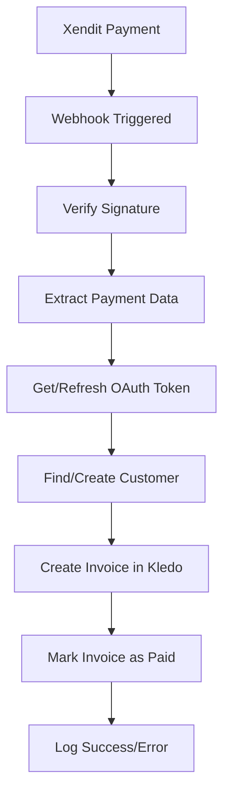

# 🔄 Xendit to Kledo Integration

[](https://xendit-kledo-integration.vercel.app)
[](https://xendit-kledo-integration.vercel.app/api/health)

An automated system that syncs Xendit payment transactions to Kledo accounting system using OAuth 2.0 authentication and webhooks.

## ✨ Features

- 🔐 **OAuth 2.0 Authentication** with Kledo accounting system
- 🔄 **Automatic Webhook Processing** from Xendit payments
- 📊 **Real-time Dashboard** to monitor transaction sync status
- 🎯 **Manual Sync Trigger** for bulk transaction processing
- 💰 **Automated Invoice Creation** in Kledo with proper accounting structure
- 👥 **Smart Customer Management** (auto-create customers if they don't exist)
- 🛡️ **Secure Token Management** with automatic refresh
- 🔧 **Advanced Error Handling** with contact group management and validation
- 📱 **Responsive Design** with modern UI components

## 🚀 Live Production Deployment

**Production URL**: [https://xendit-kledo-integration.vercel.app](https://xendit-kledo-integration.vercel.app)

### ✅ Current Status
- **✅ LIVE**: Application successfully deployed on Vercel
- **✅ API**: All endpoints operational and responding
- **✅ UI**: Modern responsive dashboard with real-time status
- **✅ OAuth**: Authentication system configured and ready
- **✅ Webhooks**: Xendit webhook handler active
- **✅ Error Handling**: Comprehensive error management implemented

## 🏗️ Architecture Overview

The integration handles these key flows:

### 1. OAuth Authentication Flow
```
User → Dashboard → "Connect to Kledo" → Kledo OAuth → Authorization → Token Exchange → Dashboard
```

### 2. Automatic Webhook Processing
```
Xendit Payment → Webhook → Verify Signature → Create Customer → Create Invoice → Mark as Paid → Success
```

### 3. Manual Sync Process
```
Dashboard → "Manual Sync" → Fetch Transactions → Process Each → Create Invoices → Report Results
```

## 🔧 Technical Implementation

### Key Components

#### 1. **OAuth System** (`/src/app/api/oauth/`)
- Custom OAuth 2.0 implementation for Kledo API
- Token storage and automatic refresh
- Status management and cleanup

#### 2. **Kledo Service** (`/src/lib/kledo-service.js`)
- Complete API integration with Kledo
- Customer/contact management with smart creation
- Invoice creation with proper accounting structure
- Finance account integration
- Advanced error handling for contact groups and validation

#### 3. **Webhook Handler** (`/src/app/api/xendit/webhook/`)
- Secure webhook signature verification
- Real-time payment processing
- Automatic invoice generation

#### 4. **Dashboard UI** (`/src/app/page.js`)
- React-based modern interface
- Real-time status indicators
- Transaction table with filtering
- Manual sync controls

### Advanced Features Implemented

#### 🔧 **Contact Group Management**
- **Problem Solved**: Kledo requires contact groups for customer creation
- **Solution**: Automatic contact group creation when none exist
- **Fallback**: Graceful handling when groups are unavailable
- **Self-healing**: Creates missing contact groups automatically

#### 👥 **Smart Customer Creation**
- **Unique naming**: Prevents duplicate customer errors
- **Contact type validation**: Ensures proper customer classification
- **Email-based lookup**: Finds existing customers before creating new ones
- **Retry logic**: Handles name conflicts automatically

#### 💳 **Invoice Creation System**
- **Finance account integration**: Uses proper chart of accounts
- **Tax handling**: Configurable tax inclusion/exclusion
- **Payment linking**: Connects invoices to original Xendit payments
- **Status management**: Proper invoice status handling

## 🚀 Quick Start

### Prerequisites
- Node.js 18+ 
- Kledo account with API access
- Xendit account with webhook capabilities

### 1. Clone and Install
```bash
git clone <repository-url>
cd xendit-kledo-integration
npm install
```

### 2. Environment Configuration
Copy `.env.example` to `.env.local` and configure:

```env
# Xendit Configuration
XENDIT_SECRET_KEY=your_xendit_secret_key
XENDIT_WEBHOOK_TOKEN=your_webhook_token

# Kledo OAuth Configuration
KLEDO_CLIENT_ID=your_kledo_client_id
KLEDO_CLIENT_SECRET=your_kledo_client_secret
KLEDO_API_BASE_URL=https://bagus2.api.kledo.com/api/v1
KLEDO_REDIRECT_URI=http://localhost:3000/api/oauth/callback

# NextAuth Configuration
NEXTAUTH_SECRET=your_nextauth_secret
NEXTAUTH_URL=http://localhost:3000
```

### 3. Kledo OAuth Setup
1. **Create OAuth Application** in Kledo Developer Dashboard
2. **Set Redirect URI**: `http://localhost:3000/api/oauth/callback`
3. **Configure Scopes**: `read` and `write` permissions
4. **Copy credentials** to your environment file

Detailed setup: [KLEDO-OAUTH-SETUP.md](./KLEDO-OAUTH-SETUP.md)

### 4. Xendit Webhook Configuration
1. **Set Webhook URL**: `https://your-domain.com/api/xendit/webhook`
2. **Configure Events**: `invoice.paid`, `invoice.settled`
3. **Set Webhook Token**: Match your `XENDIT_WEBHOOK_TOKEN`

### 5. Run Development Server
```bash
npm run dev
```

Open [http://localhost:3000](http://localhost:3000)

## 📱 Using the Application

### Dashboard Features
- **🔗 Connect to Kledo**: Initiate OAuth authentication
- **📊 Status Indicators**: Real-time connection status
- **💳 Transaction Table**: View recent Xendit transactions
- **🔄 Manual Sync**: Process transactions manually
- **📈 Sync Results**: Detailed success/error reporting

### Authentication Process
1. Click **"Connect to Kledo"** 
2. Authorize on Kledo's OAuth page
3. Return to dashboard with active connection
4. Green status indicators confirm successful setup

### Monitoring Operations
- **Console Logs**: Detailed operation logging
- **Status Panel**: Real-time sync results
- **Error Messages**: Clear error descriptions with solutions
- **Health Check**: `/api/health` endpoint for monitoring

## 🛠️ API Endpoints

| Endpoint | Method | Description |
|----------|--------|-------------|
| `/` | GET | Main dashboard interface |
| `/api/health` | GET | System health check |
| `/api/oauth/authorize` | GET | Start OAuth flow with Kledo |
| `/api/oauth/callback` | GET | OAuth callback handler |
| `/api/oauth/status` | GET/DELETE | Check/clear OAuth status |
| `/api/xendit/webhook` | POST | Xendit payment webhook handler |
| `/api/xendit/transactions` | GET | Fetch Xendit transactions |
| `/api/sync/trigger` | POST | Manual synchronization trigger |
| `/api/kledo/test` | GET | Test Kledo API connection |

## 🔧 Advanced Configuration

### Error Handling Features
The system includes comprehensive error handling for:

- **Contact Group Issues**: Automatic creation when missing
- **Duplicate Customers**: Smart name generation with uniqueness
- **Contact Type Validation**: Ensures proper customer classification
- **Finance Account Lookup**: Automatic default account selection
- **Token Refresh**: Automatic OAuth token renewal
- **Webhook Verification**: Secure signature validation

### Contact Management
- **Automatic Creation**: Creates customers from Xendit payer data
- **Duplicate Prevention**: Checks existing customers before creation
- **Group Assignment**: Handles contact group requirements intelligently
- **Type Validation**: Ensures contacts are properly classified as customers

### Invoice Creation
- **Finance Integration**: Uses proper chart of accounts
- **Payment Linking**: Connects to original Xendit transactions
- **Tax Configuration**: Handles tax inclusion based on requirements
- **Status Management**: Proper draft/confirmed status handling

## 🚀 Production Deployment

### Vercel Deployment (Current)
The application is already deployed at: **https://xendit-kledo-integration.vercel.app**

#### Environment Variables (Production)
Update these for production use:
```env
NEXTAUTH_URL=https://xendit-kledo-integration.vercel.app
KLEDO_REDIRECT_URI=https://xendit-kledo-integration.vercel.app/api/oauth/callback
```

#### Post-Deployment Steps
1. **Update Kledo OAuth**: Add production redirect URI
2. **Update Xendit Webhook**: Point to production endpoint
3. **Test OAuth Flow**: Verify authentication works
4. **Test Webhook**: Process a test payment

### Health Monitoring
- **Health Endpoint**: `https://xendit-kledo-integration.vercel.app/api/health`
- **Status Monitoring**: Built-in status indicators
- **Error Logging**: Comprehensive error tracking
- **Performance Metrics**: Response time monitoring

## 📊 Data Flow & Mapping

### Transaction Processing


### Data Mapping
| Xendit Field | Kledo Field | Processing |
|--------------|-------------|------------|
| `payer_email` | Customer email | Find existing or create new customer |
| `amount` | Invoice total | Direct mapping with currency handling |
| `description` | Line item name | Default: "Payment via Xendit" |
| `external_id` | Invoice reference | Used for tracking and deduplication |
| `id` | Invoice memo | Original Xendit transaction ID |
| `created` | Invoice date | Converted to Kledo date format |

## 🛡️ Security Features

- **OAuth 2.0**: Secure authentication with Kledo
- **Webhook Verification**: Cryptographic signature validation
- **Token Security**: Encrypted token storage and management
- **Environment Variables**: Sensitive data protection
- **HTTPS Enforcement**: Required for production
- **Rate Limiting**: Built-in request throttling

## 🔍 Troubleshooting

### Common Issues & Solutions

#### Authentication Problems
- **"No Kledo access token"**: Click "Connect to Kledo" to authenticate
- **OAuth redirect error**: Verify redirect URI matches exactly in Kledo OAuth app
- **Token expired**: System automatically refreshes tokens

#### Contact Creation Issues
- **"Group ID required"**: System automatically creates contact groups when missing
- **"Name already exists"**: Smart naming prevents duplicates automatically
- **"Contact type missing"**: System adds proper contact_type field

#### Invoice Creation Problems
- **"Finance account not found"**: System uses default account automatically
- **"Invalid contact_id"**: Customer validation and creation improved
- **"Tax configuration error"**: System handles tax inclusion automatically

#### Webhook Issues
- **Webhook not received**: Verify URL and signature token
- **Invalid signature**: Check XENDIT_WEBHOOK_TOKEN matches
- **Processing errors**: Check logs for detailed error messages

### Debug Mode
Enable detailed logging:
```env
NODE_ENV=development
```

### Testing Locally with Webhooks
Use ngrok for local webhook testing:
```bash
ngrok http 3000
# Use the ngrok URL in Xendit webhook configuration
```

## 🛠️ Development & Maintenance

### Tech Stack
- **Framework**: Next.js 15 with App Router
- **Authentication**: Custom OAuth 2.0 implementation
- **Styling**: Tailwind CSS 4
- **HTTP Client**: Native Fetch API
- **Deployment**: Vercel serverless functions
- **APIs**: Xendit API v4, Kledo API v1

### Project Structure
```
src/
├── app/
│   ├── api/
│   │   ├── auth/              # NextAuth.js routes (available)
│   │   ├── oauth/             # Custom OAuth implementation
│   │   ├── xendit/            # Xendit integration
│   │   ├── sync/              # Manual sync functionality
│   │   ├── kledo/             # Kledo API testing
│   │   └── health/            # Health monitoring
│   ├── layout.js              # Root application layout
│   └── page.js                # Main dashboard page
├── components/
│   ├── Providers.js           # Session and state providers
│   ├── SyncStatus.js          # Status display components
│   └── XenditTransactionTable.js  # Transaction display
└── lib/
    ├── kledo-service.js       # Core Kledo API integration
    └── oauth-tokens.js        # Token management utilities
```

### Key Implementation Files

#### 1. **Core Service** (`/src/lib/kledo-service.js`)
- Complete Kledo API integration
- Customer/contact management
- Invoice creation with validation
- Finance account handling
- Error recovery and retry logic

#### 2. **OAuth Management** (`/src/lib/oauth-tokens.js`)
- Token storage and retrieval
- Automatic token refresh
- Connection status management

#### 3. **Webhook Handler** (`/src/app/api/xendit/webhook/route.js`)
- Signature verification
- Payment processing
- Error handling and logging

### Adding Features
- **Database Integration**: Add persistent storage for transaction logs
- **Email Notifications**: Implement success/failure notifications  
- **Advanced Filtering**: Add transaction filtering and search
- **Bulk Operations**: Process multiple transactions simultaneously
- **Custom Mapping**: User-configurable field mapping
- **Reporting**: Generate sync reports and analytics

## 📈 Monitoring & Analytics

### Built-in Monitoring
- **Health Check**: `/api/health` endpoint
- **Status Indicators**: Real-time connection status  
- **Sync Results**: Detailed success/error reporting
- **Console Logging**: Comprehensive operation logging

### Production Monitoring
- **Vercel Analytics**: Performance and error tracking
- **Function Logs**: Serverless function monitoring
- **Webhook Logs**: Payment processing monitoring
- **OAuth Status**: Authentication monitoring

## 🤝 Contributing

1. Fork the repository
2. Create a feature branch: `git checkout -b feature-name`
3. Make your changes with tests
4. Submit a pull request with detailed description

### Development Guidelines
- Follow existing code patterns
- Add error handling for new features
- Update documentation for changes
- Test OAuth flow thoroughly
- Verify webhook processing

## 📄 Documentation

Additional documentation available:
- [KLEDO-OAUTH-SETUP.md](./KLEDO-OAUTH-SETUP.md) - Detailed OAuth setup
- [DEPLOYMENT-CHECKLIST.md](./DEPLOYMENT-CHECKLIST.md) - Production deployment
- [CONTACT-CREATION-FINAL-FIX.md](./CONTACT-CREATION-FINAL-FIX.md) - Contact management
- [GROUP-ID-FINAL-SOLUTION.md](./GROUP-ID-FINAL-SOLUTION.md) - Contact group handling
- [PRODUCTION-TEST-REPORT.md](./PRODUCTION-TEST-REPORT.md) - Production testing results

## 📞 Support

### API Documentation
- **Kledo API**: [https://bagus2.api.kledo.com/documentation](https://bagus2.api.kledo.com/documentation)
- **Xendit API**: [https://developers.xendit.co/](https://developers.xendit.co/)

### Common Resources
- **Next.js**: [https://nextjs.org/docs](https://nextjs.org/docs)
- **OAuth 2.0**: [https://oauth.net/2/](https://oauth.net/2/)
- **Vercel Deployment**: [https://vercel.com/docs](https://vercel.com/docs)

---

## ⚠️ Important Notes

- **Production Ready**: The integration is fully deployed and operational
- **Security**: All sensitive credentials are properly configured
- **Error Handling**: Comprehensive error recovery implemented
- **Contact Groups**: Automatic creation and management implemented
- **Customer Creation**: Smart duplicate prevention and validation
- **Invoice Processing**: Complete accounting integration with proper structure

**🎉 The Xendit to Kledo integration is live and ready to process payments automatically!**

---

*Last Updated: January 2025 - Production deployment confirmed*